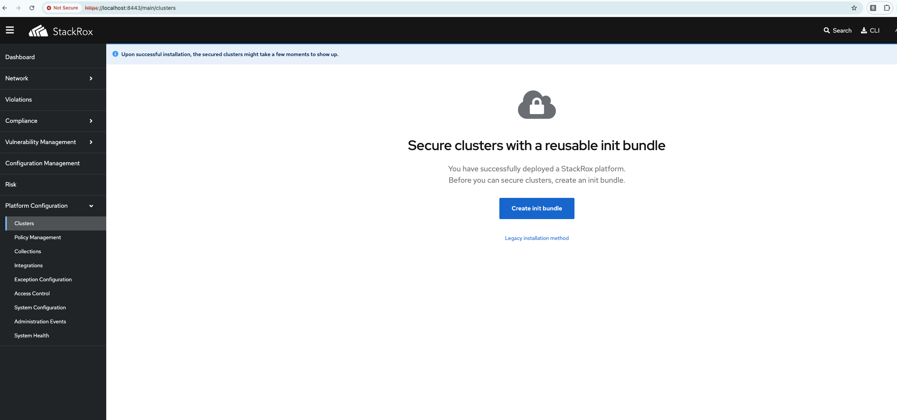
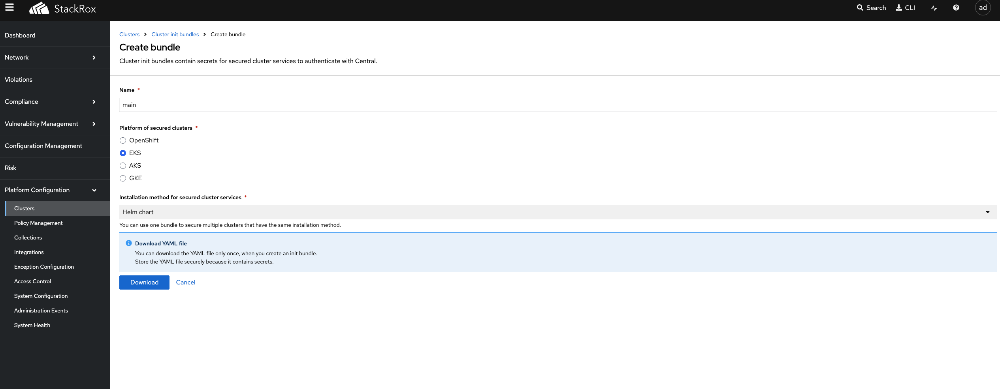
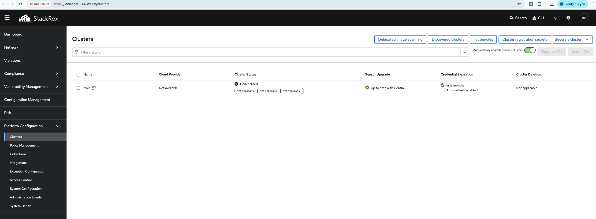
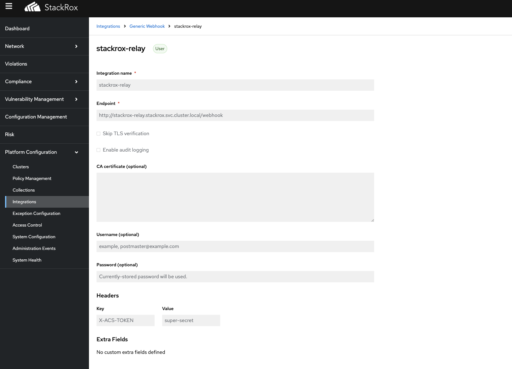
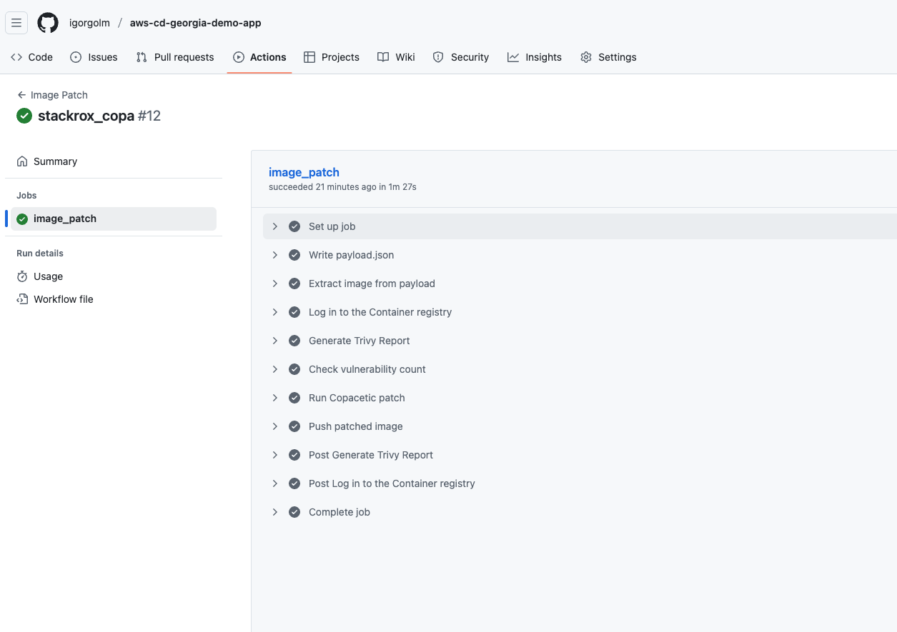
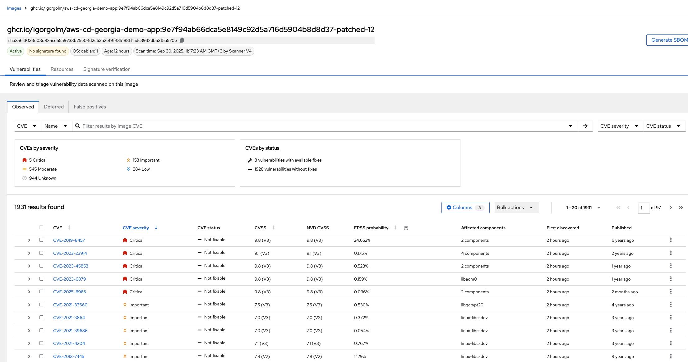

# aws-cd-georgia-workshop
This repo contains instructions to complete the AWS CD Georgia workshop.

## Environment requirements

To participate in the workshop you need a Kubernetes cluster — either local or remote.

- Local: `k0s` (https://k0sproject.io), `k3s` (https://k3s.io), `Rancher Desktop` (https://rancherdesktop.io), `Minikube` (https://minikube.sigs.k8s.io), etc.
- Remote: any existing cluster such as `EKS`, `Hetzner`, `GKE`, `AKS`, etc.
- kubectl and Helm must be installed
- DockerHub or any other Docker registry must be accessible
- Github account
- k9s :) (https://k9scli.io)

NB! In case of Mac with Apple Silicon, you need to run emulation of x86_64 architecture, because Collector serice of StackRox Secured Cluster Services is not available for Apple Silicon.
In Rancher Desktop, you can enable emulation by going to the Preferences -> Emulation -> VZ and Enable Rosetta support for [x86_64 architecture](https://docs.rancherdesktop.io/ui/preferences/virtual-machine/emulation/). Also, for Rancher Desktop, before deploying the collector DaemonSet, you need to ensure that mount propagation will work inside the Rancher Desktop VM. By default, Rancher Desktop mounts / and /proc as private, but the DaemonSet requires them to be shared (rshared). Run these commands inside the Rancher Desktop VM before starting the deployment:
```bash
rdctl shell   # enter the Rancher Desktop VM
# inside the VM:
sudo mount --make-rshared /
sudo mount --make-rshared /proc
```
This step ensures Kubernetes can use mountPropagation: HostToContainer without failing with "/proc is not a shared or slave mount" errors.

## Components:
- K8s cluster
- StackRox Central Services
- StackRox Secured Cluster Services
- StackRox Relay
- Demo application


### StackRox Central Services Installation
We'll install StackRox Central Services in the cluster using official Helm chart.

```bash
$ helm repo add stackrox https://raw.githubusercontent.com/stackrox/helm-charts/main/opensource/
$ helm repo update
$ helm install stackrox-central-services stackrox/stackrox-central-services -f stackrox/central-services/values.yaml -n stackrox --create-namespace --version 400.8.4
```
For getting access to the StackRox Central Services, you can port-forward to the StackRox Central Services and access it via the browser.
```bash
$ kubectl port-forward svc/stackrox-central-services-central 8443:443 -n stackrox
```
Then, you can access the StackRox Central Services via the browser at https://localhost:8443. The username and password are the same as the ones you saw in the helm output.

#### Stackrox Setup
Go to the StackRox Central Services and create a new init bundle.

Choose name and platform for the init bundle.


Init bundle will be created and downloaded to your local machine. We'll use it later to install the StackRox Secured Cluster Services.

### StackRox Secured Cluster Services Installation
We'll install StackRox Secured Cluster Services in the cluster using official Helm chart.

```bash
$ helm repo add stackrox https://raw.githubusercontent.com/stackrox/helm-charts/main/opensource/
$helm repo update
$ helm install stackrox-secured-cluster-services stackrox/stackrox-secured-cluster-services -f stackrox/secured-cluster-services/values.yaml  -f stackrox/secured-cluster-services/values-init-bundle.yaml -n stackrox --version 400.8.4
```

After the installation is complete we can see in the Clusters our new cluster `main`.


### StackRox Relay Installation
We need this service to relay events from StackRox to GitHub. We'll install it using Helm chart from our repository.
```bash
git clone https://github.com/igorgolm/stackrox-relay-service.git
cd helm-chart
```
But before installing the Helm chart, we need to
1. Create a GitHub Personal Access Token with the following permissions:
- Actions: Read and write
- Workflows: Read and write
- Contents: Read and write
- Metadata: Read

Save the token to the `values.yaml` file.
```yaml
configmap:
  GH_TOKEN: "your-token"
```

2. Create a random secret for StackRox webhook.
```yaml
configmap:
  STACKROX_WEBHOOK_SECRET: "your-secret"
```
3. Set GH_REPO and GH_OWNER in the `values.yaml` file.
```yaml
configmap:
  GH_REPO: "your-repo"
  GH_OWNER: "your-owner"
```

Then, install the Helm chart.
```bash
helm install stackrox-relay . -f values.yaml -n stackrox
```

4. Create a Generic Webhook in StackRox.

- name: `stackrox-relay`
- Endpoint: `http://stackrox-relay.stackrox.svc.cluster.local/webhook` (cluster internal address)
- Headers: `X-ACS-TOKEN: <value of STACKROX_WEBHOOK_SECRET>`
- Extra fields: not required — the relay adds `event_type` and `client_payload` automatically.
- Attach your policy (e.g., "No Critical CVEs") to this notifier in Enforce on Admission mode. When a deployment is blocked, StackRox will send an event to the relay.

### No Critical CVEs Policy
We need to create a policy to block deployments with critical CVEs. You can find the policy in the `stackrox/policies/no-critical-cves.yaml` file, but before applying it, you need to update the cluster ID (cluster id you can find in the StackRox Central Services in clusters list).
```bash
sed -i 's/ed1c6b50-da2a-4e2b-af1d-78c9453ab77d/<your-cluster-id>/g' stackrox/policies/no-critical-cves.yaml
kubectl apply -f stackrox/policies/no-critical-cves.yaml -n stackrox
```

### Demo Application
We need to deploy the demo application with vulnerability.
```bash
cd aws-cd-georgia-demo-app/helm-chart
helm install aws-cd-georgia-demo-app . -f values.yaml -n demo --create-namespace
```

Check that helm release was created.
If our policy is working, the deployment will be downscaled to 0 replicas, because of critical vulnerability and in Stackrox dashboard we can see the violation.


Also, relay webhook will be called with the vulnerability information and relay will dispatch event to GitHub Actions workflow. Workflow will patch the image and push it to the registry.

Check that the image was patched.

### Upgrade the application with patched image
We need to upgrade the application with patched image and check that the deployment was scaled back to 1 replica.
```bash
cd aws-cd-georgia-demo-app/helm-chart
helm upgrade aws-cd-georgia-demo-app . -f values.yaml -n demo
```

Check that the deployment was scaled back to 1 replica.


Go to Stackrox Vulnerability Management and check image vulnerability status. Now it should show that the all fixable vulnerabilities are fixed.

